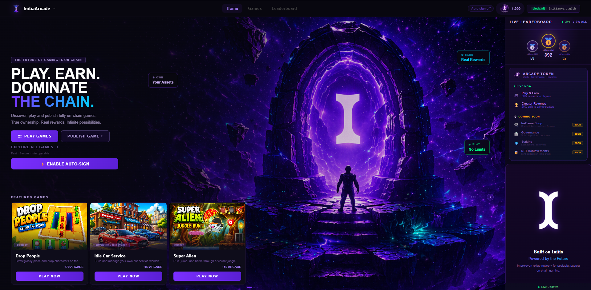
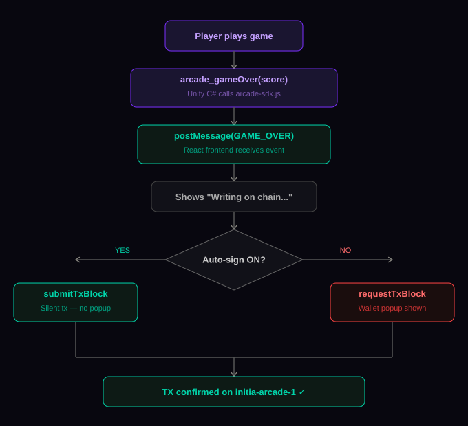
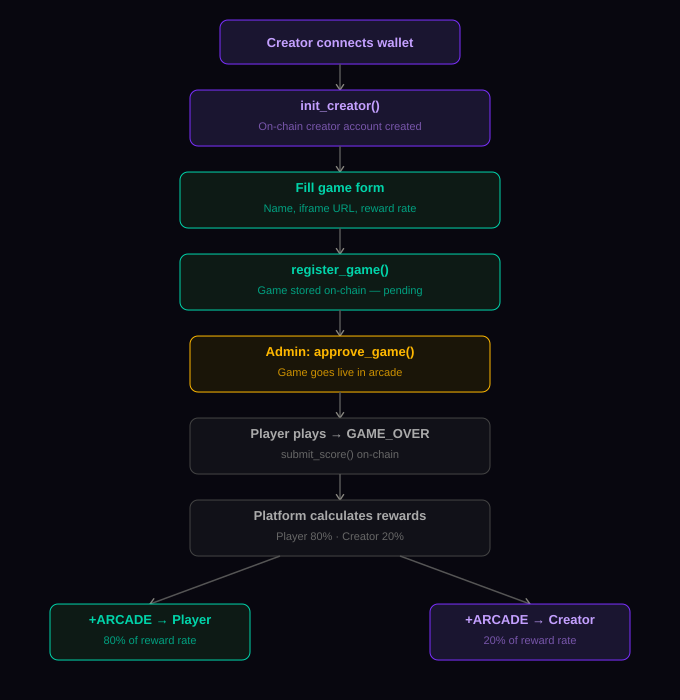

<div align="center">

<br />



<br />

# 🕹️ INITIA ARCADE

### The world's first sovereign on-chain multi-game arcade platform with a full creator economy — built on Initia MoveVM.

<br />

[](https://initia.xyz)
[](https://move-language.github.io)
[]()
[]()
[]()
[]()
[]()
[]()
[](https://dorahacks.io/hackathon/initiate)

<br />

> **Every game platform takes your rewards. Every score lives on a server someone else controls.**
> **Every creator gets a fraction of what they deserve. Players earn nothing for their time.**
>
> **InitiaArcade changes all of that.**
>
> *Play. Earn. Dominate. The Chain.*

<br />

</div>

---

## 🏆 Hackathon Submission

| Field | Value |
|:---|:---|
| **Project Name** | InitiaArcade |
| **Hackathon** | INITIATE Season 1 |
| **Chain ID** | `initia-arcade-1` |
| **VM** | MoveVM (Minitia L2) |
| **L1 Network** | Initia `initiation-2` |
| **Native Feature** | Auto-Signing via `@initia/interwovenkit-react` |
| **Contract Address** | `0xd1aa08d2de31ca1af55682f4185547f92332bee` |
| **Contract Modules** | `platform.move` · `leaderboard.move` · `arcade_token.move` |
| **Frontend** | React + Vite + Firebase Firestore |
| **Token** | ARCADE (custom Move token) |
| **Games Live** | 7+ across 6 categories |

---

## 📦 What InitiaArcade Is

InitiaArcade is a **sovereign on-chain multi-game arcade platform** running on its own Initia appchain (`initia-arcade-1`). It is the first platform where:

- **Players earn real on-chain tokens** (ARCADE) for every game they play
- **Creators publish games on-chain** and earn **20% of all rewards** their games generate — forever
- **Every score** is a signed transaction on `initia-arcade-1` — immutable, verifiable, trustless
- **Auto-signing** makes the blockchain completely invisible — playing feels like any traditional web game
- **Any developer** can integrate their Unity WebGL game via the open `arcade-sdk.js` SDK

```
Traditional gaming platform          InitiaArcade
─────────────────────────────        ──────────────────────────────────────
Scores → server database      →      Scores → signed txs → initia-arcade-1
Rewards → platform keeps all  →      Rewards → 80% player, 20% creator
Game publishing → centralized →      Game publishing → on-chain registration
Identity → username/password  →      Identity → wallet address
UX → smooth, no friction      →      UX → auto-sign, equally frictionless
Creator revenue → tiny cut    →      Creator revenue → 20% automatic, forever
Token rewards → none          →      Token rewards → ARCADE on every play
```

---

## 🏗️ Architecture Overview

InitiaArcade is built from four tightly integrated layers:

```
┌─────────────────────────────────────────────────────────────────┐
│                     initia-arcade (Frontend)                    │
│                  React + Vite + Firebase Firestore              │
│                                                                 │
│  ┌──────────────┐  ┌──────────────┐  ┌────────────────────────┐ │
│  │  Game Library│  │  Creator Hub │  │   Live Leaderboard     │ │
│  │  7+ Games    │  │  Publish &   │  │   On-Chain Scores      │ │
│  │  Filter/Search│ │  Track Earn  │  │   Global Rankings      │ │
│  └──────────────┘  └──────────────┘  └────────────────────────┘ │
│                                                                 │
│  ┌──────────────┐  ┌──────────────┐  ┌────────────────────────┐ │
│  │  Admin Panel │  │  Community   │  │   ARCADE Token         │ │
│  │  Approve     │  │  Likes &     │  │   Balance & Rewards    │ │
│  │  Games       │  │  Comments    │  │   Live in Navbar       │ │
│  └──────────────┘  └──────────────┘  └────────────────────────┘ │
│                                                                 │
│          InterwovenKit — auto-signing · wallet · bridge         │
└──────────────────────────────┬──────────────────────────────────┘
                               │  iframe + postMessage SDK
┌──────────────────────────────▼──────────────────────────────────┐
│                     arcade-sdk.js (Game SDK)                    │
│             Unity WebGL / HTML5 Game Integration Layer          │
│                                                                 │
│  arcade_init() · arcade_gameOver() · arcade_updateScore()       │
│  arcade_earnTokens() · arcade_getPlayerInfo() · arcade_buyItem()│
└──────────────────────────────┬──────────────────────────────────┘
                               │
┌──────────────────────────────▼──────────────────────────────────┐
│                  contracts (MoveVM)                             │
│            Sovereign Minitia L2 — initia-arcade-1               │
│                                                                 │
│  ┌─────────────────┐  ┌─────────────────┐  ┌─────────────────┐  │
│  │  platform.move  │  │ leaderboard     │  │ arcade_token    │  │
│  │                 │  │ .move           │  │ .move           │  │
│  │  register_game  │  │ submit_score    │  │ initialize      │  │
│  │  approve_game   │  │ get_player_stats│  │ mint_tokens     │  │
│  │  record_play    │  │                 │  │ spend_tokens    │  │
│  │  init_creator   │  │                 │  │ get_balance     │  │
│  └─────────────────┘  └─────────────────┘  └─────────────────┘  │
└──────────────────────────────┬──────────────────────────────────┘
                               │  OPinit Optimistic Rollup
┌──────────────────────────────▼──────────────────────────────────┐
│                   Initia L1 — initiation-2                      │
│         Security · Finality · Fraud Proofs · Shared Liquidity   │
└─────────────────────────────────────────────────────────────────┘
```

---

## ⚙️ How It Works

### Game Score Lifecycle

<div align="center">

</div>

### Creator Economy Flow

<div align="center">

</div>

---

## 🔩 Smart Contract Reference

### `platform.move` — Game Registry & Creator Economy

The platform contract is the backbone of InitiaArcade. It manages game registration, approval, creator accounts, and reward distribution.

| Function | Parameters | Description |
|:---|:---|:---|
| `init_creator()` | — | Initializes a new creator account resource on-chain |
| `register_game(contract, name, iframe_url, reward_rate)` | address, string, string, u64 | Creator registers a new game |
| `approve_game(contract, game_id)` | address, u64 | Admin approves game — makes it live on platform |
| `record_play_and_earn(contract, game_id, reward_rate)` | address, u64, u64 | Records a play session and triggers reward distribution |

**Key Design:** Each game is stored as a Move `Game` resource with fields: `game_id`, `name`, `iframe_url`, `reward_rate`, `creator`, `status`, `total_plays`. The `next_game_id` counter is stored as a global Platform resource — this is what the frontend queries to get the next available game ID.

### `leaderboard.move` — On-Chain Score Tracking

Every score submitted by a player is recorded immutably on `initia-arcade-1`.

| Function | Parameters | Description |
|:---|:---|:---|
| `submit_score(contract, game_id, score)` | address, u64, u64 | Submits player score — creates immutable ScoreRecord |
| `get_player_stats(player)` | address | Returns player's total games played and highest scores |

**Key Design:** `ScoreRecord` resources are append-only. Once written, a score cannot be modified or deleted. This makes the leaderboard fully trustless — no server can manipulate rankings.

### `arcade_token.move` — ARCADE Token System

The ARCADE token is InitiaArcade's native reward token, implemented as a Move resource.

| Function | Parameters | Description |
|:---|:---|:---|
| `initialize()` | — | Initializes the ARCADE token contract state |
| `init_player()` | — | Creates ArcadeBalance resource for new player |
| `mint_tokens(player, amount)` | address, u64 | Mints ARCADE tokens to player wallet |
| `spend_tokens(player, amount)` | address, u64 | Deducts ARCADE tokens (future: in-game purchases) |
| `get_balance(player)` | address | Returns current ARCADE token balance |

**Key Design:** `ArcadeBalance` is a typed Move resource — not a mapping in a global table. Each player's balance is a first-class resource stored at their address, benefiting from Move's ownership and safety guarantees.

---

## 🎮 Game SDK — `arcade-sdk.js`

Any developer can publish their Unity WebGL or HTML5 game on InitiaArcade by including `arcade-sdk.js` in their build. The SDK bridges the game iframe to the platform via `postMessage`.

### JavaScript API

```javascript
// Initialize SDK — call once on game load
ArcadeSDK.init(gameId, { debug: true });

// Send real-time score updates (no blockchain tx)
ArcadeSDK.updateScore(score);

// Trigger game over + on-chain score submission
ArcadeSDK.gameOver(finalScore);

// Award bonus ARCADE tokens for achievements
ArcadeSDK.earnTokens(amount);

// Request connected player's wallet info
ArcadeSDK.getPlayerInfo(function(player) {
  console.log(player.address, player.balance);
});

// Record level completion
ArcadeSDK.levelComplete(level, score);

// Trigger in-game purchase
ArcadeSDK.buyItem(itemId, price);
```

### Unity C# Bridge

```csharp
// In your ArcadeManager.cs
public void SubmitScore() {
    if (isSubmitted) return;
    isSubmitted = true;
    #if UNITY_WEBGL && !UNITY_EDITOR
        arcade_gameOver(currentScore);
    #else
        Debug.Log("Score: " + currentScore);
    #endif
}

// Update score in real-time during gameplay
void Update() {
    arcade_updateScore(currentScore);
}
```

### SDK Events Reference

| Event (game → platform) | Payload | Description |
|:---|:---|:---|
| `SDK_READY` | `{ gameId }` | SDK initialized |
| `SCORE_UPDATE` | `{ score }` | Real-time score update |
| `GAME_OVER` | `{ score }` | Final score → triggers on-chain tx |
| `EARN_TOKENS` | `{ amount }` | Award bonus ARCADE |
| `LEVEL_COMPLETE` | `{ level, score }` | Level completion |
| `GET_PLAYER_INFO` | `{}` | Request player wallet info |
| `BUY_ITEM` | `{ itemId, price }` | In-game purchase trigger |

| Event (platform → game) | Payload | Description |
|:---|:---|:---|
| `PLAYER_INFO` | `{ address, username, balance }` | Player wallet data |
| `TRANSACTION_SUCCESS` | `{ txHash }` | Score submitted on-chain |
| `TRANSACTION_FAILED` | `{ error }` | Transaction error |

---

## ✨ Full Feature Set

| Feature | Status | Description |
|:---|:---:|:---|
| 🎮 **Multi-Game Library** | ✅ | 7+ live games — Action, Puzzle, Runner, Strategy, Shooter, Casual |
| ⚡ **Auto-Signing** | ✅ | One approval. Silent transactions. Zero popups during gameplay |
| 🏆 **On-Chain Leaderboard** | ✅ | Every score is a signed tx on `initia-arcade-1` |
| 💰 **Creator Economy** | ✅ | Publish games, earn 20% of all ARCADE rewards forever |
| 🪙 **ARCADE Token** | ✅ | Native reward token — earned by playing, tracked on-chain |
| 🔧 **Admin Approval Flow** | ✅ | Games verified on-chain before going live |
| 🛠️ **Unity WebGL SDK** | ✅ | `arcade-sdk.js` — third-party game integration |
| 👥 **Community Features** | ✅ | Likes and comments per game |
| 📊 **Creator Dashboard** | ✅ | Track games published, earnings, plays |
| 🔍 **Game Discovery** | ✅ | Filter by category, search by name |
| 👛 **Wallet Integration** | ✅ | InterwovenKit — MetaMask, Privy, social login |
| 🔄 **Auto-Sign Countdown** | ✅ | Live expiry timer in navbar and home page |
| 🌐 **Custom Chain Explorer** | ✅ | Initia Scan with `initia-arcade-1` custom rollup |
| 🎯 **Multi-Play Reset** | ✅ | Multiple plays per session — each submits fresh tx |

---

## 🔄 Auto-Sign Deep Dive

The defining UX challenge of on-chain games is the **wallet interruption problem**. Every transaction requires a popup. For a game that submits a score on every play, this means interrupting the player's flow constantly.

InitiaArcade solves this using Initia's native **auto-signing** feature via `@initia/interwovenkit-react`.

### Comparison

```
Without Auto-Signing                  With InitiaArcade Auto-Signing
─────────────────────────────         ──────────────────────────────────
Play game #1 → WALLET POPUP  →        Home: Enable auto-sign (ONE time)
Play game #2 → WALLET POPUP  →        Play game #1 → silent tx → ✓ on-chain
Play game #3 → WALLET POPUP  →        Play game #2 → silent tx → ✓ on-chain
...                                   Play game #3 → silent tx → ✓ on-chain
Every play: 2-5s interruption         Zero interruptions. Sub-second.
```

### Technical Implementation

```javascript
// Providers.jsx — per-chain auto-sign config
<InterwovenKitProvider
  {...TESTNET}
  defaultChainId={CHAIN_ID}
  customChain={isLocal ? customChain : undefined}
  enableAutoSign={{
    [CHAIN_ID]: [
      "/initia.move.v1.MsgExecute",
      "/cosmos.bank.v1beta1.MsgSend",
    ],
  }}
>

// EnableAutoSign.jsx — enable/disable with countdown
const { autoSign } = useInterwovenKit();
const enable = useMutation({
  mutationFn: () => autoSign.enable(CHAIN_ID),
});

// GamePlay.jsx — detect and route transactions
const isAutoSign = autoSign?.isEnabledByChain?.[CHAIN_ID];

if (isAutoSign) {
  const gasEstimate = await estimateGas({ messages });
  const fee = {
    gas: String(Math.ceil(gasEstimate * 1.4)),
    amount: [{ denom: "umin", amount: String(Math.ceil(gasEstimate * 1.4 * 0.015)) }]
  };
  result = await submitTxBlock({ messages, fee }); // NO POPUP
} else {
  result = await requestTxBlock({ messages }); // Wallet popup
}
```

### Auto-Sign Session Properties

| Property | Value |
|:---|:---|
| **Message types** | `/initia.move.v1.MsgExecute`, `/cosmos.bank.v1beta1.MsgSend` |
| **Scope** | Strictly `initia-arcade-1` chain only |
| **Duration** | User-selected: 10 minutes to 30 days |
| **Revocable** | Anytime from home page "Revoke" button |
| **Fee coverage** | Automatic via `feegrant` |
| **Ghost wallet** | Derived deterministically from connected wallet |
| **Status display** | Live countdown timer — purple → red on near-expiry |

---

## 📁 Repository Structure

```
initia-arcade/
│
├── contracts/
│   └── sources/
│       ├── platform.move          # Game registry, creator economy, reward distribution
│       ├── leaderboard.move       # Score submission, player stats, immutable records
│       └── arcade_token.move      # ARCADE token, mint/spend/balance logic
│
├── src/
│   ├── components/
│   │   ├── EnableAutoSign.jsx     # Auto-sign enable/disable with live countdown timer
│   │   ├── GameCard.jsx           # Game card with 16:9 thumbnail, hover effects
│   │   └── Navbar.jsx             # Navigation + auto-sign status badge + ARCADE balance
│   │
│   ├── pages/
│   │   ├── GamePlay.jsx           # Game iframe + auto-sign score + community section
│   │   ├── Creator.jsx            # Creator dashboard + on-chain game publishing
│   │   ├── Home.jsx               # Landing + featured games + leaderboard sidebar
│   │   ├── GameLibrary.jsx        # All games with category filter + search
│   │   ├── Leaderboard.jsx        # Global on-chain leaderboard
│   │   └── Admin.jsx              # Admin game approval panel
│   │
│   ├── hooks/
│   │   ├── useGames.js            # Firebase approved games hook
│   │   └── useArcadeBalance.js    # On-chain ARCADE balance (polls every 15s)
│   │
│   └── lib/
│       ├── firebase.js            # Firebase Firestore config
│       └── gameService.js         # Firebase + on-chain service layer
│
├── public/
│   └── arcade-sdk.js             # Unity WebGL SDK for third-party developers
│
├── .initia/
│   └── submission.json           # Hackathon submission metadata
│
├── .env                          # Chain config (not committed — see Quick Start)
├── README.md                     # This file
└── package.json
```

---

## 🛠️ Tech Stack

| Layer | Technology | Role |
|:---|:---|:---|
| Smart Contracts | Move (MoveVM) | Game registry, leaderboard, ARCADE token |
| L2 Rollup | Initia OPinit Stack | Sovereign appchain `initia-arcade-1` |
| L1 Security | Initia `initiation-2` | Finality, shared liquidity, settlement |
| Frontend Shell | React + Vite | App routing, state management, UI |
| Database | Firebase Firestore | Game metadata, scores cache, comments, likes |
| Wallet | InterwovenKit v2.6 | Auto-signing, wallet connection, custom chain |
| Game Integration | Unity WebGL + iframe | Third-party game SDK via postMessage |
| Chain Binary | `minitiad` v1.1.11 | Local chain node |
| Chain Setup | `weave` CLI | Appchain initialization and management |

---

## 🚀 Quick Start

**Prerequisites:** `weave` CLI · Node.js 18+ · Go 1.22+ · WSL2 (Windows) or Linux

### Step 1 — Initialize the Appchain

```bash
weave init
# Prompts:
# - VM: Move
# - Chain ID: initia-arcade-1
# - Gas denom: umin (press Tab for default)
# - Add Gas Station to genesis: Yes
# - Genesis balance: 10000000000000000000
```

### Step 2 — Import Keys

```bash
MNEMONIC=$(jq -r '.common.gas_station.mnemonic' ~/.weave/config.json)

minitiad keys add gas-station --recover --keyring-backend test \
  --coin-type 60 --key-type eth_secp256k1 --source <(echo -n "$MNEMONIC")
```

### Step 3 — Start the Chain

```bash
# Start in background tmux session
tmux new-session -d -s arcade 'minitiad start --home ~/.minitia'

# Verify
curl http://localhost:1317/cosmos/base/tendermint/v1beta1/blocks/latest \
  | grep chain_id
# → "chain_id":"initia-arcade-1"
```

### Step 4 — Deploy Contracts

```bash
cd contracts

minitiad move deploy \
  --keyring-backend test \
  --from gas-station \
  --gas auto --gas-adjustment 1.5 \
  --gas-prices 0.015umin \
  --node http://localhost:26657 \
  --chain-id initia-arcade-1 -y
```

### Step 5 — Initialize Contracts

```bash
CONTRACT=<YOUR_DEPLOYED_ADDRESS>

# Initialize arcade token
minitiad tx move execute $CONTRACT arcade_token initialize \
  --args '[]' \
  --from gas-station --keyring-backend test \
  --gas auto --gas-adjustment 1.5 --gas-prices 0.015umin \
  --node http://localhost:26657 --chain-id initia-arcade-1 -y
```

### Step 6 — Configure Frontend

```bash
cat > .env << 'EOF'
VITE_CHAIN_ID=initia-arcade-1
VITE_RPC_URL=http://localhost:26657
VITE_REST_URL=http://localhost:1317
VITE_CONTRACT=<YOUR_DEPLOYED_CONTRACT_ADDRESS>
VITE_GAS_DENOM=umin
EOF
```

### Step 7 — Fund Your Wallet

```bash
# Fund your browser wallet
minitiad tx bank send gas-station <YOUR_WALLET_ADDRESS> 5000000umin \
  --keyring-backend test --gas auto --gas-adjustment 1.5 \
  --gas-prices 0.015umin --node http://localhost:26657 \
  --chain-id initia-arcade-1 -y
```

### Step 8 — Launch Frontend

```bash
npm install && npm run dev
```

> Open `http://localhost:5173` — InitiaArcade is live! 🎮

---

## 🌐 Endpoints Reference

| Service | URL | Purpose |
|:---|:---|:---|
| Rollup RPC | `http://localhost:26657` | Transaction broadcast, block queries |
| Rollup REST | `http://localhost:1317` | REST API, contract state queries |
| Frontend | `http://localhost:5173` | InitiaArcade web app |
| Block Explorer | `https://scan.testnet.initia.xyz/initia-arcade-1` | Add custom rollup, inspect txs |
| L1 Testnet RPC | `https://rpc.testnet.initia.xyz` | L1 connection |
| L1 Testnet REST | `https://rest.testnet.initia.xyz` | L1 REST queries |
| Faucet | `https://app.testnet.initia.xyz/faucet` | Get testnet INIT tokens |

---

## 🔬 Verifying Deployments

```bash
CONTRACT=<YOUR_DEPLOYED_ADDRESS>

# Verify all three modules
for module in platform leaderboard arcade_token; do
  minitiad query move module $CONTRACT $module \
    --node http://localhost:26657 --output json | \
    python3 -c "import json,sys; d=json.load(sys.stdin); print('✅' if d.get('module') else '❌', '$module')"
done

# Check exposed functions
minitiad query move module $CONTRACT platform \
  --node http://localhost:26657 --output json | python3 -c \
  "import json,sys; d=json.load(sys.stdin); abi=json.loads(d['module']['abi']); [print(' -', f['name']) for f in abi['exposed_functions']]"
```

---

## 🎯 Hackathon Submission Detail

### What Makes InitiaArcade Original

| Feature | Single Game Apps | InitiaArcade |
|:---|:---:|:---:|
| Multiple games | ❌ | ✅ 7+ live |
| Creator publishing | ❌ | ✅ On-chain |
| Creator revenue | ❌ | ✅ 20% automatic |
| Token rewards | ❌ | ✅ ARCADE token |
| Game SDK | ❌ | ✅ arcade-sdk.js |
| Admin approval | ❌ | ✅ On-chain |
| Community features | ❌ | ✅ Likes + comments |
| Custom chain | ✅ | ✅ initia-arcade-1 |
| Auto-sign | ✅ | ✅ Full implementation |

### The Custom Implementation

Three Move modules working together as a platform ecosystem:

- **`platform.move`** manages the full game registry — registration, approval, creator accounts, and reward routing. The `next_game_id` counter is a on-chain resource — the frontend queries it to auto-assign game IDs without any central database.

- **`leaderboard.move`** creates immutable `ScoreRecord` resources — append-only, trustless. No server can modify a submitted score.

- **`arcade_token.move`** implements the ARCADE token as typed Move resources with full mint/spend/balance logic. `ArcadeBalance` is stored at each player's address — not in a central mapping.

**Unity WebGL SDK:** `arcade-sdk.js` implements a complete postMessage bridge protocol. Any Unity WebGL game integrates with a single C# call: `arcade_gameOver(currentScore)`. The platform handles the entire blockchain transaction silently.

### The Native Feature — Auto-Signing

InitiaArcade implements **auto-signing** as a core UX feature across the entire platform:

1. **Discovery** — Home page explains auto-sign with a prominent enable button and live countdown timer
2. **Activation** — `EnableAutoSign.jsx` calls `autoSign.enable(CHAIN_ID)` — InterwovenKit handles `authz` + `feegrant` automatically on-chain
3. **Status** — Live countdown timer color-coded: green (active) → red (near expiry / expired)
4. **Navbar badge** — Auto-sign status always visible: `⚡ 6m 43s` in the top navigation
5. **Transaction routing** — `GamePlay.jsx` detects `isAutoSign` and routes to `submitTxBlock` with `estimateGas` for accurate fees
6. **Fallback** — If auto-sign is disabled, `requestTxBlock` provides wallet popup transparently

The result: a player who enables auto-sign experiences InitiaArcade identically to a traditional web game — while every score is being immutably recorded on `initia-arcade-1`.

---

<div align="center">

<br />

*Built on the Interwoven Stack — INITIATE Season 1*

*Play. Earn. Dominate. The Chain.*

</div>
